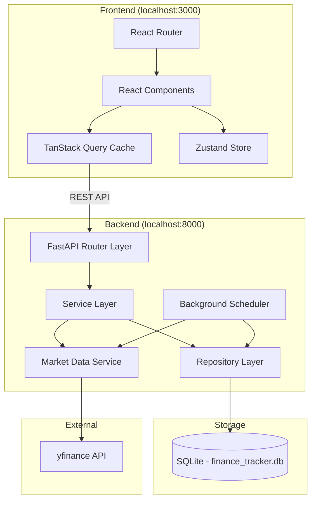
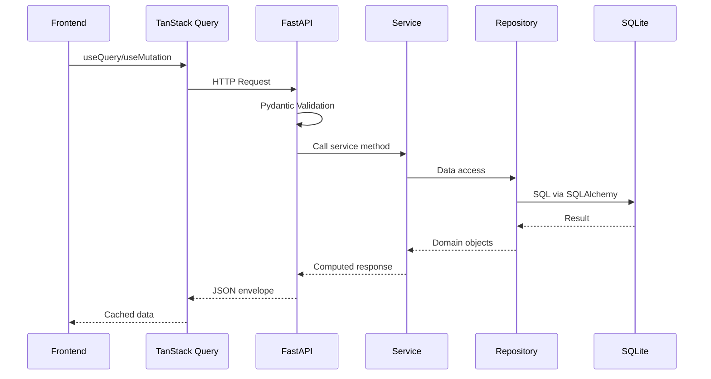
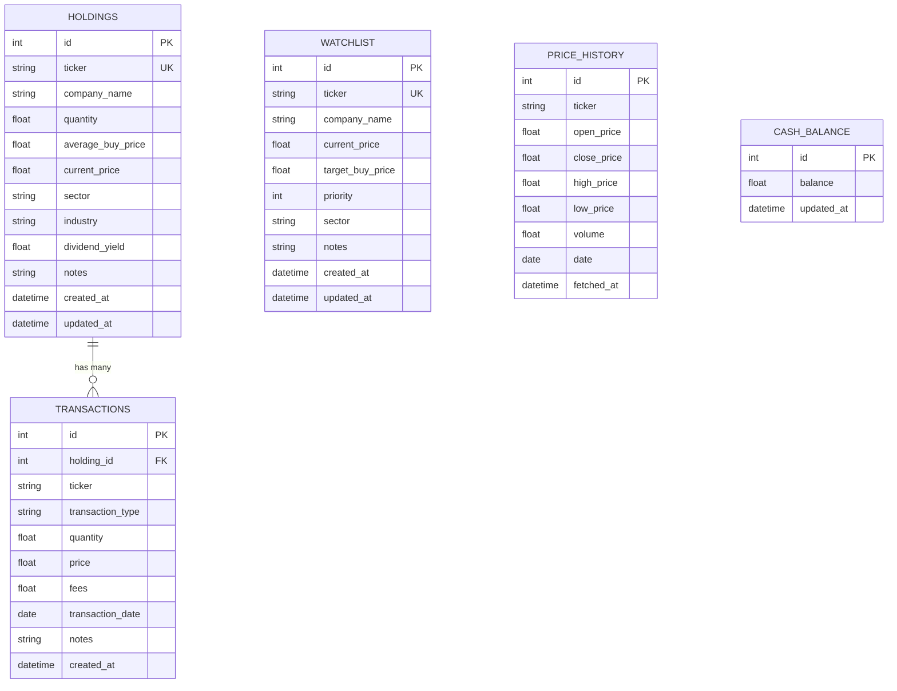

# Design Document: Personal Finance Dashboard

## Overview

The Personal Finance Dashboard is a locally hosted single-user application for tracking stock portfolios and watchlists. It consists of a React/TypeScript frontend served on localhost:3000 and a FastAPI/Python backend on localhost:8000, with SQLite as the persistence layer. Market data is fetched via yfinance on a configurable interval.

The system follows a layered architecture: the frontend handles presentation and client-side state, communicates over REST with the backend, which manages business logic, data access, and external market data integration. All data is stored locally in a single SQLite file (`finance_tracker.db`), making the application fully offline-capable between market data refreshes.

### Key Design Decisions

1. **SQLite over PostgreSQL**: Single-user, local-only use case makes SQLite the right choice — zero configuration, file-based, and sufficient for the data volume (≤100 holdings).
2. **yfinance for market data**: Free, no API key required, provides comprehensive stock data including dividends, history, and analyst ratings.
3. **Zustand over Redux**: Lightweight state management appropriate for the application's complexity — fewer boilerplate requirements.
4. **TanStack Query for server state**: Handles caching, background refetching, and stale data indicators without manual implementation.
5. **Recharts for visualization**: React-native charting library with good TypeScript support and composable API.

## Architecture

### System Architecture Diagram



### Layer Responsibilities

| Layer | Responsibility |
|-------|---------------|
| **React Components** | Render UI, handle user interactions, form validation |
| **TanStack Query** | Server state caching, background refetch, optimistic updates |
| **Zustand Store** | Client-only state: theme, sidebar collapse, UI filters |
| **FastAPI Router** | Request parsing, Pydantic validation, response envelope |
| **Service Layer** | Business logic, calculations, orchestration |
| **Repository Layer** | SQLAlchemy ORM queries, transaction management |
| **Market Data Service** | yfinance integration, retry logic, caching |
| **Background Scheduler** | Periodic market data refresh (APScheduler) |

### Request Flow



## Components and Interfaces

### Backend Components

#### API Router Layer (`backend/app/routers/`)

```
routers/
├── holdings.py      # /api/holdings endpoints
├── transactions.py  # /api/transactions endpoints
├── watchlist.py     # /api/watchlist endpoints
├── dashboard.py     # /api/dashboard endpoints
└── market.py        # /api/market endpoints
```

#### Service Layer (`backend/app/services/`)

```python
# holdings_service.py
class HoldingsService:
    def get_all_holdings() -> list[HoldingResponse]
    def get_holding(holding_id: int) -> HoldingResponse
    def create_holding(data: HoldingCreate) -> HoldingResponse
    def update_holding(holding_id: int, data: HoldingUpdate) -> HoldingResponse
    def delete_holding(holding_id: int) -> None
    def calculate_portfolio_metrics(holdings: list[Holding]) -> PortfolioMetrics

# transaction_service.py
class TransactionService:
    def get_transactions(holding_id: int) -> list[TransactionResponse]
    def create_transaction(data: TransactionCreate) -> TransactionResponse
    def delete_transaction(transaction_id: int) -> None
    def recalculate_holding(holding_id: int) -> None

# watchlist_service.py
class WatchlistService:
    def get_all_items() -> list[WatchlistResponse]
    def create_item(data: WatchlistCreate) -> WatchlistResponse
    def update_item(item_id: int, data: WatchlistUpdate) -> WatchlistResponse
    def delete_item(item_id: int) -> None
    def move_to_holdings(item_id: int, holding_data: HoldingCreate) -> HoldingResponse

# dashboard_service.py
class DashboardService:
    def get_summary() -> DashboardSummary
    def get_activity_feed(limit: int = 20) -> list[ActivityEvent]
    def get_portfolio_history(days: int = 30) -> list[PortfolioSnapshot]

# market_data_service.py
class MarketDataService:
    def fetch_quote(ticker: str) -> MarketQuote
    def fetch_history(ticker: str, period: str) -> list[PricePoint]
    def refresh_all_prices() -> RefreshResult
    def get_cached_price(ticker: str) -> float | None
```

#### Repository Layer (`backend/app/repositories/`)

```python
# holdings_repository.py
class HoldingsRepository:
    def get_all(db: Session) -> list[Holding]
    def get_by_id(db: Session, holding_id: int) -> Holding | None
    def get_by_ticker(db: Session, ticker: str) -> Holding | None
    def create(db: Session, holding: Holding) -> Holding
    def update(db: Session, holding: Holding) -> Holding
    def delete(db: Session, holding_id: int) -> None

# transaction_repository.py
class TransactionRepository:
    def get_by_holding(db: Session, holding_id: int) -> list[Transaction]
    def get_by_id(db: Session, transaction_id: int) -> Transaction | None
    def create(db: Session, transaction: Transaction) -> Transaction
    def delete(db: Session, transaction_id: int) -> None
    def get_all_ordered(db: Session) -> list[Transaction]

# watchlist_repository.py
class WatchlistRepository:
    def get_all(db: Session) -> list[WatchlistItem]
    def get_by_id(db: Session, item_id: int) -> WatchlistItem | None
    def get_by_ticker(db: Session, ticker: str) -> WatchlistItem | None
    def create(db: Session, item: WatchlistItem) -> WatchlistItem
    def update(db: Session, item: WatchlistItem) -> WatchlistItem
    def delete(db: Session, item_id: int) -> None

# price_history_repository.py
class PriceHistoryRepository:
    def get_history(db: Session, ticker: str, days: int) -> list[PriceHistory]
    def store_prices(db: Session, prices: list[PriceHistory]) -> None
    def delete_older_than(db: Session, days: int) -> int
```

### Frontend Components

#### Page Components (`frontend/src/pages/`)

```
pages/
├── Dashboard.tsx       # Main dashboard with metrics, charts, activity
├── Holdings.tsx        # Holdings table with search/filter/sort
├── Watchlist.tsx       # Watchlist table with CRUD
└── Settings.tsx        # Theme toggle, refresh interval config
```

#### Feature Components (`frontend/src/components/`)

```
components/
├── layout/
│   ├── Sidebar.tsx           # Navigation sidebar
│   ├── AppLayout.tsx         # Main layout wrapper
│   └── ThemeToggle.tsx       # Dark/light mode toggle
├── holdings/
│   ├── HoldingsTable.tsx     # Main holdings data table
│   ├── HoldingRow.tsx        # Individual holding row (expandable)
│   ├── HoldingForm.tsx       # Add/edit holding modal form
│   ├── TransactionHistory.tsx # Expanded row transaction list
│   ├── SearchFilter.tsx      # Search + filter controls
│   └── DeleteConfirmation.tsx # Delete confirmation dialog
├── watchlist/
│   ├── WatchlistTable.tsx    # Watchlist data table
│   ├── WatchlistForm.tsx     # Add/edit watchlist item form
│   └── MoveToHoldings.tsx    # Move-to-holdings flow
├── dashboard/
│   ├── MetricsCards.tsx      # Summary metric cards
│   ├── PortfolioGrowthChart.tsx  # Line chart
│   ├── SectorAllocationChart.tsx # Pie chart
│   ├── GainersLosersChart.tsx    # Bar chart
│   ├── DividendForecastChart.tsx # Bar/line chart
│   ├── WatchlistMoversChart.tsx  # Movers display
│   └── ActivityFeed.tsx      # Recent activity list
└── shared/
    ├── EmptyState.tsx        # Reusable empty state
    ├── ErrorNotification.tsx # Toast/notification component
    ├── LoadingSpinner.tsx    # Loading indicator
    └── DataTable.tsx         # Reusable table component
```

#### API Layer (`frontend/src/api/`)

```typescript
// api/client.ts - Axios instance with base URL, timeout, retry
// api/holdings.ts - Holdings API functions
// api/transactions.ts - Transaction API functions
// api/watchlist.ts - Watchlist API functions
// api/dashboard.ts - Dashboard API functions
// api/market.ts - Market data API functions
```

#### Hooks (`frontend/src/hooks/`)

```typescript
// hooks/useHoldings.ts - TanStack Query hooks for holdings
// hooks/useTransactions.ts - TanStack Query hooks for transactions
// hooks/useWatchlist.ts - TanStack Query hooks for watchlist
// hooks/useDashboard.ts - TanStack Query hooks for dashboard
// hooks/useMarket.ts - TanStack Query hooks for market data
```

#### Store (`frontend/src/store/`)

```typescript
// store/uiStore.ts - Zustand store for UI state
interface UIState {
  theme: 'light' | 'dark';
  sidebarCollapsed: boolean;
  holdingsFilter: {
    search: string;
    sector: string | null;
    performance: 'all' | 'gainers' | 'losers';
    sortColumn: string;
    sortDirection: 'asc' | 'desc';
  };
  setTheme: (theme: 'light' | 'dark') => void;
  toggleSidebar: () => void;
  setHoldingsFilter: (filter: Partial<HoldingsFilter>) => void;
}
```

### API Contracts

#### Response Envelope

```typescript
interface ApiResponse<T> {
  success: boolean;
  data: T | null;
  error: string | null;
}
```

#### Holdings API

| Method | Endpoint | Request Body | Response |
|--------|----------|-------------|----------|
| GET | `/api/holdings` | — | `ApiResponse<HoldingResponse[]>` |
| GET | `/api/holdings/{id}` | — | `ApiResponse<HoldingResponse>` |
| POST | `/api/holdings` | `HoldingCreate` | `ApiResponse<HoldingResponse>` (201) |
| PUT | `/api/holdings/{id}` | `HoldingUpdate` | `ApiResponse<HoldingResponse>` |
| DELETE | `/api/holdings/{id}` | — | `ApiResponse<null>` |

#### Transactions API

| Method | Endpoint | Request Body | Response |
|--------|----------|-------------|----------|
| GET | `/api/transactions?holding_id={id}` | — | `ApiResponse<TransactionResponse[]>` |
| POST | `/api/transactions` | `TransactionCreate` | `ApiResponse<TransactionResponse>` (201) |
| DELETE | `/api/transactions/{id}` | — | `ApiResponse<null>` |

#### Watchlist API

| Method | Endpoint | Request Body | Response |
|--------|----------|-------------|----------|
| GET | `/api/watchlist` | — | `ApiResponse<WatchlistResponse[]>` |
| POST | `/api/watchlist` | `WatchlistCreate` | `ApiResponse<WatchlistResponse>` (201) |
| PUT | `/api/watchlist/{id}` | `WatchlistUpdate` | `ApiResponse<WatchlistResponse>` |
| DELETE | `/api/watchlist/{id}` | — | `ApiResponse<null>` |

#### Dashboard API

| Method | Endpoint | Request Body | Response |
|--------|----------|-------------|----------|
| GET | `/api/dashboard/summary` | — | `ApiResponse<DashboardSummary>` |
| GET | `/api/dashboard/activity` | — | `ApiResponse<ActivityEvent[]>` |
| GET | `/api/dashboard/history?days={n}` | — | `ApiResponse<PortfolioSnapshot[]>` |

#### Market API

| Method | Endpoint | Request Body | Response |
|--------|----------|-------------|----------|
| GET | `/api/market/quote/{ticker}` | — | `ApiResponse<MarketQuote>` |
| GET | `/api/market/history/{ticker}?period={p}` | — | `ApiResponse<PricePoint[]>` |

## Data Models

### Database Schema (SQLAlchemy Models)



### SQLAlchemy Model Definitions

```python
# backend/app/models/holding.py
class Holding(Base):
    __tablename__ = "holdings"

    id: Mapped[int] = mapped_column(primary_key=True)
    ticker: Mapped[str] = mapped_column(String(10), unique=True, nullable=False)
    company_name: Mapped[str] = mapped_column(String(200), nullable=True)
    quantity: Mapped[float] = mapped_column(Float, nullable=False)
    average_buy_price: Mapped[float] = mapped_column(Float, nullable=False)
    current_price: Mapped[float] = mapped_column(Float, default=0.0)
    sector: Mapped[str | None] = mapped_column(String(100), nullable=True)
    industry: Mapped[str | None] = mapped_column(String(100), nullable=True)
    dividend_yield: Mapped[float] = mapped_column(Float, default=0.0)
    notes: Mapped[str | None] = mapped_column(Text, nullable=True)
    created_at: Mapped[datetime] = mapped_column(DateTime, default=func.now())
    updated_at: Mapped[datetime] = mapped_column(DateTime, default=func.now(), onupdate=func.now())

    transactions: Mapped[list["Transaction"]] = relationship(back_populates="holding", cascade="all, delete-orphan")

# backend/app/models/transaction.py
class Transaction(Base):
    __tablename__ = "transactions"

    id: Mapped[int] = mapped_column(primary_key=True)
    holding_id: Mapped[int] = mapped_column(ForeignKey("holdings.id"), nullable=False)
    ticker: Mapped[str] = mapped_column(String(10), nullable=False)
    transaction_type: Mapped[str] = mapped_column(String(4), nullable=False)  # "buy" or "sell"
    quantity: Mapped[float] = mapped_column(Float, nullable=False)
    price: Mapped[float] = mapped_column(Float, nullable=False)
    fees: Mapped[float] = mapped_column(Float, default=0.0)
    transaction_date: Mapped[date] = mapped_column(Date, nullable=False)
    notes: Mapped[str | None] = mapped_column(Text, nullable=True)
    created_at: Mapped[datetime] = mapped_column(DateTime, default=func.now())

    holding: Mapped["Holding"] = relationship(back_populates="transactions")

# backend/app/models/watchlist_item.py
class WatchlistItem(Base):
    __tablename__ = "watchlist"

    id: Mapped[int] = mapped_column(primary_key=True)
    ticker: Mapped[str] = mapped_column(String(10), unique=True, nullable=False)
    company_name: Mapped[str | None] = mapped_column(String(200), nullable=True)
    current_price: Mapped[float] = mapped_column(Float, default=0.0)
    target_buy_price: Mapped[float | None] = mapped_column(Float, nullable=True)
    priority: Mapped[int] = mapped_column(Integer, default=3)
    sector: Mapped[str | None] = mapped_column(String(100), nullable=True)
    notes: Mapped[str | None] = mapped_column(Text, nullable=True)
    created_at: Mapped[datetime] = mapped_column(DateTime, default=func.now())
    updated_at: Mapped[datetime] = mapped_column(DateTime, default=func.now(), onupdate=func.now())

# backend/app/models/price_history.py
class PriceHistory(Base):
    __tablename__ = "price_history"

    id: Mapped[int] = mapped_column(primary_key=True)
    ticker: Mapped[str] = mapped_column(String(10), nullable=False, index=True)
    open_price: Mapped[float] = mapped_column(Float, nullable=True)
    close_price: Mapped[float] = mapped_column(Float, nullable=False)
    high_price: Mapped[float] = mapped_column(Float, nullable=True)
    low_price: Mapped[float] = mapped_column(Float, nullable=True)
    volume: Mapped[float] = mapped_column(Float, nullable=True)
    date: Mapped[date] = mapped_column(Date, nullable=False)
    fetched_at: Mapped[datetime] = mapped_column(DateTime, default=func.now())

    __table_args__ = (UniqueConstraint("ticker", "date", name="uq_ticker_date"),)

# backend/app/models/cash_balance.py
class CashBalance(Base):
    __tablename__ = "cash_balance"

    id: Mapped[int] = mapped_column(primary_key=True)
    balance: Mapped[float] = mapped_column(Float, default=0.0)
    updated_at: Mapped[datetime] = mapped_column(DateTime, default=func.now(), onupdate=func.now())
```

### Pydantic Schemas

```python
# backend/app/schemas/holding.py
class HoldingCreate(BaseModel):
    ticker: str = Field(..., min_length=1, max_length=5, pattern=r"^[A-Z]{1,5}$")
    quantity: float = Field(..., gt=0)
    buy_price: float = Field(..., ge=0.01)
    company_name: str | None = None
    sector: str | None = None
    industry: str | None = None
    notes: str | None = None

class HoldingUpdate(BaseModel):
    company_name: str | None = None
    sector: str | None = None
    industry: str | None = None
    notes: str | None = None

class HoldingResponse(BaseModel):
    id: int
    ticker: str
    company_name: str | None
    quantity: float
    average_buy_price: float
    current_price: float
    total_invested: float
    current_value: float
    unrealized_gain: float
    unrealized_gain_pct: float
    allocation_pct: float
    sector: str | None
    industry: str | None
    dividend_yield: float
    annual_dividend_income: float
    created_at: datetime
    updated_at: datetime

# backend/app/schemas/transaction.py
class TransactionCreate(BaseModel):
    ticker: str = Field(..., min_length=1, max_length=5, pattern=r"^[A-Z]{1,5}$")
    transaction_type: Literal["buy", "sell"]
    quantity: float = Field(..., gt=0)
    price: float = Field(..., ge=0.01)
    fees: float = Field(default=0.0, ge=0)
    transaction_date: date
    notes: str | None = None

class TransactionResponse(BaseModel):
    id: int
    holding_id: int
    ticker: str
    transaction_type: str
    quantity: float
    price: float
    fees: float
    transaction_date: date
    notes: str | None
    created_at: datetime

# backend/app/schemas/watchlist.py
class WatchlistCreate(BaseModel):
    ticker: str = Field(..., min_length=1, max_length=5, pattern=r"^[A-Z]{1,5}$")
    target_buy_price: float | None = Field(default=None, ge=0.01, le=999999.99)
    priority: int = Field(default=3, ge=1, le=5)
    notes: str | None = Field(default=None, max_length=500)

class WatchlistUpdate(BaseModel):
    target_buy_price: float | None = Field(default=None, ge=0.01, le=999999.99)
    priority: int | None = Field(default=None, ge=1, le=5)
    sector: str | None = None
    notes: str | None = Field(default=None, max_length=500)

class WatchlistResponse(BaseModel):
    id: int
    ticker: str
    company_name: str | None
    current_price: float
    daily_change_pct: float
    week_52_high: float
    week_52_low: float
    target_buy_price: float | None
    analyst_rating: str | None
    pe_ratio: float | None
    market_cap: float | None
    sector: str | None
    notes: str | None
    priority: int
    created_at: datetime
    updated_at: datetime

# backend/app/schemas/dashboard.py
class DashboardSummary(BaseModel):
    total_portfolio_value: float
    total_invested: float
    unrealized_gain: float
    realized_gain: float
    daily_change: float
    annual_dividend_income: float
    cash_position: float
    number_of_holdings: int
    stale_data: bool = False
    last_successful_fetch: datetime | None = None

class ActivityEvent(BaseModel):
    event_type: Literal["holding_added", "stock_sold", "watchlist_added", "watchlist_removed", "notes_updated"]
    ticker: str
    details: dict
    timestamp: datetime

class PortfolioSnapshot(BaseModel):
    date: date
    total_value: float

# backend/app/schemas/market.py
class MarketQuote(BaseModel):
    ticker: str
    current_price: float
    previous_close: float
    daily_change: float
    daily_change_pct: float
    week_52_high: float
    week_52_low: float
    market_cap: float | None
    pe_ratio: float | None
    dividend_yield: float
    analyst_rating: str | None

class PricePoint(BaseModel):
    date: date
    open: float
    close: float
    high: float
    low: float
    volume: float
```

### TypeScript Types (Frontend)

```typescript
// frontend/src/types/holding.ts
interface Holding {
  id: number;
  ticker: string;
  company_name: string | null;
  quantity: number;
  average_buy_price: number;
  current_price: number;
  total_invested: number;
  current_value: number;
  unrealized_gain: number;
  unrealized_gain_pct: number;
  allocation_pct: number;
  sector: string | null;
  industry: string | null;
  dividend_yield: number;
  annual_dividend_income: number;
  created_at: string;
  updated_at: string;
}

interface HoldingCreate {
  ticker: string;
  quantity: number;
  buy_price: number;
  company_name?: string;
  sector?: string;
  industry?: string;
  notes?: string;
}

// frontend/src/types/transaction.ts
interface Transaction {
  id: number;
  holding_id: number;
  ticker: string;
  transaction_type: 'buy' | 'sell';
  quantity: number;
  price: number;
  fees: number;
  transaction_date: string;
  notes: string | null;
  created_at: string;
}

// frontend/src/types/dashboard.ts
interface DashboardSummary {
  total_portfolio_value: number;
  total_invested: number;
  unrealized_gain: number;
  realized_gain: number;
  daily_change: number;
  annual_dividend_income: number;
  cash_position: number;
  number_of_holdings: number;
  stale_data: boolean;
  last_successful_fetch: string | null;
}

interface ActivityEvent {
  event_type: 'holding_added' | 'stock_sold' | 'watchlist_added' | 'watchlist_removed' | 'notes_updated';
  ticker: string;
  details: Record<string, unknown>;
  timestamp: string;
}
```


## Correctness Properties

*A property is a characteristic or behavior that should hold true across all valid executions of a system — essentially, a formal statement about what the system should do. Properties serve as the bridge between human-readable specifications and machine-verifiable correctness guarantees.*

### Property 1: Per-holding metrics calculation

*For any* holding with positive quantity and positive average_buy_price, and any non-negative current_price and dividend_yield, the system SHALL compute:
- unrealized_gain = (current_price - average_buy_price) × quantity
- unrealized_gain_pct = ((current_price - average_buy_price) / average_buy_price) × 100, rounded to 2 decimal places
- allocation_pct = (current_price × quantity) / total_portfolio_value × 100, rounded to 2 decimal places (or 0 if total_portfolio_value is 0)
- annual_dividend_income = dividend_per_share × quantity (or 0 if dividend data unavailable)

**Validates: Requirements 1.2, 1.3, 1.4, 1.7**

### Property 2: Holdings search filter

*For any* list of holdings and any search string, the filtered result SHALL contain exactly those holdings where the ticker or company_name contains the search string as a case-insensitive substring, and no others.

**Validates: Requirements 2.1**

### Property 3: Holdings sort correctness

*For any* list of holdings and any valid sort column and direction, the sorted result SHALL be ordered such that for every adjacent pair of elements, the comparison of the sort column values respects the specified direction (ascending or descending).

**Validates: Requirements 2.2**

### Property 4: Holdings predicate filter

*For any* list of holdings and any sector filter value, the filtered result SHALL contain only holdings whose sector matches the filter. *For any* performance filter ("gainers" or "losers"), the filtered result SHALL contain only holdings with unrealized_gain > 0 (gainers) or unrealized_gain < 0 (losers) respectively.

**Validates: Requirements 2.3, 2.4**

### Property 5: Create holding produces consistent records

*For any* valid holding input (ticker 1-5 uppercase chars, quantity > 0, buy_price >= 0.01), creating a holding SHALL produce both a Holding record and a Transaction record where the transaction's ticker, quantity, and price match the input, and the returned HoldingResponse includes all calculated fields with values consistent with the input data.

**Validates: Requirements 3.1, 3.5**

### Property 6: Reject invalid holding inputs

*For any* quantity <= 0 or buy_price < 0.01, the system SHALL reject the holding creation request and return an error response without modifying the database.

**Validates: Requirements 3.6**

### Property 7: Buy transaction weighted average

*For any* existing holding with average_buy_price and quantity, and any buy transaction with price > 0 and transaction_quantity > 0, after processing the buy transaction the holding's new average_buy_price SHALL equal ((old_avg × old_qty) + (price × transaction_quantity)) / (old_qty + transaction_quantity) and the new quantity SHALL equal old_qty + transaction_quantity.

**Validates: Requirements 4.1**

### Property 8: Sell transaction realized gain

*For any* existing holding and any valid sell transaction (quantity <= holding quantity), the realized_gain SHALL equal (sell_price - average_buy_price) × quantity_sold, and the holding quantity SHALL decrease by quantity_sold.

**Validates: Requirements 4.2**

### Property 9: Transaction history ordering

*For any* holding with multiple transactions, the transaction history SHALL be returned in descending order by transaction_date, such that each transaction's date is greater than or equal to the next transaction's date in the list.

**Validates: Requirements 4.3**

### Property 10: Transaction deletion recalculates holding

*For any* holding with multiple buy transactions, deleting any single transaction SHALL result in a holding whose average_buy_price and quantity are equivalent to replaying all remaining buy transactions in chronological order from an empty state.

**Validates: Requirements 4.4**

### Property 11: Reject sell exceeding quantity

*For any* holding and any sell transaction where the sell quantity exceeds the holding's current quantity, the system SHALL reject the transaction with a 422 status code without modifying the holding.

**Validates: Requirements 4.5**

### Property 12: Watchlist input validation

*For any* watchlist creation input, the system SHALL accept the input if and only if: ticker matches pattern `^[A-Z]{1,5}$`, target_buy_price (if provided) is between 0.01 and 999,999.99, priority is between 1 and 5, and notes (if provided) is at most 500 characters.

**Validates: Requirements 5.2**

### Property 13: Portfolio aggregate metrics

*For any* set of holdings with known current_price, average_buy_price, quantity, and previous_close_price, the dashboard summary SHALL compute:
- total_portfolio_value = Σ(current_price × quantity) for all holdings
- total_invested = Σ(average_buy_price × quantity) for all holdings
- daily_change = Σ((current_price - previous_close) × quantity) for all holdings

**Validates: Requirements 6.2, 6.3, 6.4**

### Property 14: Cash position tracking

*For any* sequence of buy and sell transactions applied to an initial cash balance, the cash_position SHALL equal initial_balance + Σ(sell_price × qty for all sells) - Σ(buy_price × qty + fees for all buys).

**Validates: Requirements 6.6**

### Property 15: Top gainers and losers selection

*For any* set of holdings with computed unrealized_gain_pct, the top gainers list SHALL contain the 5 holdings with the highest unrealized_gain_pct (or all holdings if fewer than 5), and the top losers list SHALL contain the 5 holdings with the lowest unrealized_gain_pct (or all holdings if fewer than 5).

**Validates: Requirements 7.3**

### Property 16: Watchlist movers filter

*For any* set of watchlist items with daily_change_pct values, the movers list SHALL contain exactly those items where daily_change_pct >= 2.0 or daily_change_pct <= -2.0, and no others.

**Validates: Requirements 7.5**

### Property 17: Activity feed ordering and limit

*For any* set of activity events, the activity feed SHALL return at most 20 events ordered by timestamp descending, where each event's timestamp is greater than or equal to the next event's timestamp in the list.

**Validates: Requirements 8.1, 8.6**

### Property 18: Database transaction rollback

*For any* write operation (create, update, delete) that fails mid-execution, the database state after the failure SHALL be identical to the database state before the operation was attempted.

**Validates: Requirements 10.7, 14.5**

### Property 19: API response contract

*For any* API request to any endpoint, the response body SHALL conform to the envelope format `{success: boolean, data: T | null, error: string | null}` where success=true implies error=null and data is non-null, and success=false implies data=null and error is non-null. Additionally, for any request body that fails Pydantic validation, the response SHALL have status code 422 with field-level error details.

**Validates: Requirements 11.6, 11.7**

### Property 20: Error responses hide internals

*For any* internal server error (500 response), the error message in the response SHALL NOT contain stack traces, file paths, database query strings, or internal class/function names.

**Validates: Requirements 14.2**

### Property 21: Theme persistence round trip

*For any* theme value ('light' or 'dark'), setting the theme SHALL persist it to localStorage such that reading the theme preference from localStorage returns the same value.

**Validates: Requirements 13.3**

## Error Handling

### Backend Error Strategy

| Error Type | HTTP Status | Behavior |
|-----------|-------------|----------|
| Pydantic validation failure | 422 | Return field-level errors in envelope format |
| Resource not found | 404 | Return "resource not found" message |
| Business rule violation (e.g., sell > quantity) | 422 | Return descriptive error message |
| Duplicate resource (e.g., duplicate ticker) | 422 | Return "already exists" message |
| Database write failure | 500 | Rollback transaction, log exception, return generic error |
| Market data fetch failure | N/A (background) | Retry 3× with 5s delay, fall back to cached prices |
| Corrupted/missing database | N/A (startup) | Log error, exit with non-zero code |

### Backend Error Response Format

```python
# All error responses follow this structure:
{
    "success": False,
    "data": None,
    "error": "Human-readable error message without internal details"
}

# Validation errors include field details:
{
    "success": False,
    "data": None,
    "error": "Validation failed: quantity must be greater than 0; buy_price must be at least 0.01"
}
```

### Backend Exception Handling Pattern

```python
# Global exception handler in FastAPI
@app.exception_handler(Exception)
async def global_exception_handler(request: Request, exc: Exception):
    logger.error(f"Internal error: {type(exc).__name__}: {exc} | path={request.url.path}")
    return JSONResponse(
        status_code=500,
        content={"success": False, "data": None, "error": "An internal error occurred"}
    )

@app.exception_handler(RequestValidationError)
async def validation_exception_handler(request: Request, exc: RequestValidationError):
    errors = "; ".join([f"{e['loc'][-1]}: {e['msg']}" for e in exc.errors()])
    return JSONResponse(
        status_code=422,
        content={"success": False, "data": None, "error": f"Validation failed: {errors}"}
    )
```

### Frontend Error Strategy

| Error Type | Behavior |
|-----------|----------|
| Network timeout (10s) | Retry up to 3× with exponential backoff, then show notification |
| Connection refused | Show persistent notification until next successful request |
| 422 validation error | Display field-level errors on the form |
| 404 not found | Show "not found" message, redirect to list view |
| 500 server error | Show generic error notification |
| Stale market data | Show stale data indicator badge on affected components |

### Frontend Error Handling Pattern

```typescript
// api/client.ts - Axios instance with retry
const apiClient = axios.create({
  baseURL: 'http://localhost:8000',
  timeout: 10000,
});

// TanStack Query global error handler
const queryClient = new QueryClient({
  defaultOptions: {
    queries: {
      retry: 3,
      retryDelay: (attemptIndex) => Math.min(1000 * 2 ** attemptIndex, 10000),
      staleTime: 30000,
    },
    mutations: {
      retry: 0, // Don't retry mutations
    },
  },
});
```

### Market Data Service Error Handling

```python
class MarketDataService:
    MAX_RETRIES = 3
    RETRY_DELAY_SECONDS = 5

    async def fetch_with_retry(self, ticker: str) -> MarketQuote | None:
        for attempt in range(self.MAX_RETRIES):
            try:
                data = yf.Ticker(ticker).info
                if not data.get("currentPrice") or not isinstance(data["currentPrice"], (int, float)):
                    logger.warning(f"Invalid price data for {ticker}: missing or non-numeric currentPrice")
                    return None
                return self._parse_quote(data)
            except Exception as e:
                logger.error(f"Fetch failed for {ticker} (attempt {attempt + 1}): {e}")
                if attempt < self.MAX_RETRIES - 1:
                    await asyncio.sleep(self.RETRY_DELAY_SECONDS)
        return None  # All retries exhausted, caller uses cached price
```

## Testing Strategy

### Dual Testing Approach

This feature uses both unit/example-based tests and property-based tests for comprehensive coverage.

**Unit tests** cover:
- Specific UI rendering (correct columns displayed, empty states)
- Integration points (API calls, database operations)
- Edge cases (empty portfolio, zero values, corrupted data)
- Error handling flows (network failures, validation errors)

**Property-based tests** cover:
- All calculation logic (unrealized gain, allocation, weighted average, realized gain)
- Filter/sort correctness (search, sector filter, performance filter, sorting)
- Data integrity (transaction rollback, recalculation on delete)
- API contract consistency (response envelope, status codes)
- Input validation (reject invalid inputs across all valid/invalid combinations)

### Property-Based Testing Configuration

- **Backend**: Use [Hypothesis](https://hypothesis.readthedocs.io/) for Python property-based testing
- **Frontend**: Use [fast-check](https://fast-check.dev/) for TypeScript property-based testing
- **Minimum iterations**: 100 per property test
- **Tag format**: `Feature: personal-finance-dashboard, Property {number}: {property_text}`

### Backend Test Structure

```
backend/tests/
├── unit/
│   ├── test_holdings_service.py
│   ├── test_transaction_service.py
│   ├── test_watchlist_service.py
│   ├── test_dashboard_service.py
│   └── test_market_data_service.py
├── property/
│   ├── test_metrics_calculation.py      # Properties 1, 13, 14, 15
│   ├── test_transaction_logic.py        # Properties 7, 8, 10, 11
│   ├── test_filter_sort.py              # Properties 2, 3, 4, 16, 17
│   ├── test_validation.py              # Properties 6, 12, 19
│   ├── test_data_integrity.py          # Property 18
│   └── test_error_handling.py          # Property 20
├── integration/
│   ├── test_holdings_api.py
│   ├── test_transactions_api.py
│   ├── test_watchlist_api.py
│   ├── test_dashboard_api.py
│   └── test_market_api.py
└── conftest.py                          # Shared fixtures, test DB setup
```

### Frontend Test Structure

```
frontend/src/__tests__/
├── unit/
│   ├── components/
│   │   ├── HoldingsTable.test.tsx
│   │   ├── WatchlistTable.test.tsx
│   │   ├── DashboardMetrics.test.tsx
│   │   └── Charts.test.tsx
│   └── hooks/
│       ├── useHoldings.test.ts
│       └── useDashboard.test.ts
├── property/
│   ├── filter-sort.property.test.ts     # Properties 2, 3, 4
│   ├── theme-persistence.property.test.ts # Property 21
│   └── api-contract.property.test.ts    # Property 19 (frontend validation)
└── setup.ts                             # Test setup, MSW handlers
```

### Test Coverage Requirements

- **Backend**: Minimum 70% code coverage (pytest-cov)
- **Frontend**: Minimum 70% code coverage (Vitest coverage)
- **Property tests**: 100 iterations minimum per property
- **CI integration**: All tests run on every commit

### Key Testing Tools

| Layer | Tool | Purpose |
|-------|------|---------|
| Backend unit/integration | pytest | Test runner |
| Backend property | Hypothesis | Property-based testing |
| Backend coverage | pytest-cov | Coverage reporting |
| Backend mocking | unittest.mock / pytest-mock | Mock yfinance, DB |
| Frontend unit | Vitest + React Testing Library | Component/hook tests |
| Frontend property | fast-check | Property-based testing |
| Frontend coverage | @vitest/coverage-v8 | Coverage reporting |
| Frontend mocking | MSW (Mock Service Worker) | API mocking |
